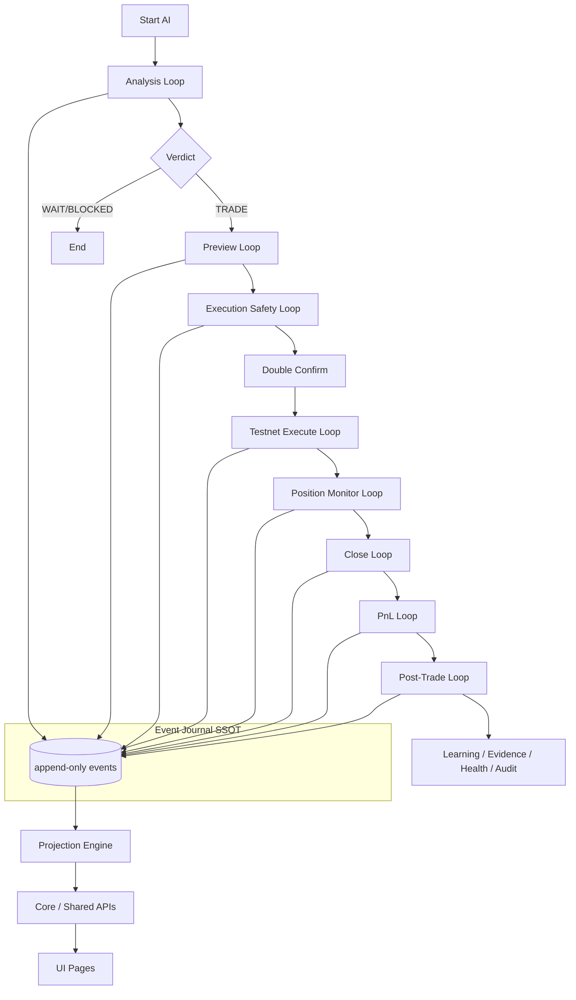

# Core Engine Upgrade Design

Branch: **`v2-core`**  
Project: **btc-short-premium-agent**  
Date: **2026-06-06**  
Prerequisite: [CORE_ENGINE_RESEARCH_DISCOVERY.md](./CORE_ENGINE_RESEARCH_DISCOVERY.md)

---

## 1. Current architecture map

```
┌─────────────────────────────────────────────────────────────────────────┐
│                         UI (Next.js pages)                               │
│   Dashboard │ Trades │ AI Status │ Reports │ Settings │ Operator        │
└───────────────────────────────┬─────────────────────────────────────────┘
                                │ GET/POST APIs only
┌───────────────────────────────▼─────────────────────────────────────────┐
│                    API Routes (75 endpoints)                               │
│  analysis │ execution │ positions │ pnl │ operator │ portfolio-risk │ …  │
└───────────────────────────────┬─────────────────────────────────────────┘
                                │
        ┌───────────────────────┼───────────────────────┐
        │                       │                       │
        ▼                       ▼                       ▼
┌───────────────┐     ┌─────────────────┐     ┌─────────────────┐
│ Loop modules  │     │  Gate modules   │     │ Projection fns  │
│ analysis      │     │ risk-gate       │     │ mission-snapshot│
│ execution     │     │ exec-safety     │     │ trade-store     │
│ close         │     │ close-safety    │     │ position-monitor│
│ post-trade    │     │ operator        │     │ evidence-progress│
│ mirofish      │     │ portfolio-risk  │     │ strategy-health │
└───────┬───────┘     └────────┬────────┘     └────────┬────────┘
        │                      │                         │
        └──────────────────────┼─────────────────────────┘
                               │ appendEvent / getEvents
                    ┌──────────▼──────────┐
                    │   Event Journal      │
                    │ event-journal.json   │
                    │ (SSOT — 86 types)    │
                    └─────────────────────┘
```

**Strengths:** Working end-to-end testnet loop, 148 tests, advisory agent layers, operator control, audit pack.

**Weaknesses:** No append validation, scattered projections, implicit lifecycle, fragmented health, duplicate gate logic.

---

## 2. Target architecture map

```
┌─────────────────────────────────────────────────────────────────────────┐
│                              UI (unchanged routes)                       │
└───────────────────────────────┬─────────────────────────────────────────┘
                                │
┌───────────────────────────────▼─────────────────────────────────────────┐
│  NEW: /api/core/health │ /replay │ /trace/[id] │ /projections/*        │
└───────────────────────────────┬─────────────────────────────────────────┘
                                │
┌───────────────────────────────▼─────────────────────────────────────────┐
│                         core-engine.ts (facade)                          │
│  appendValidatedEvent │ buildProjections │ evaluateHealth │ buildTrace   │
└───┬─────────────┬─────────────┬─────────────┬─────────────┬─────────────┘
    │             │             │             │             │
    ▼             ▼             ▼             ▼             ▼
event-store   event-      projection-   lifecycle-    core-health
(adapter)     validator     engine      state-machine
    │             │             │             │
    └─────────────┴─────────────┴─────────────┘
                                │
                    ┌───────────▼───────────┐
                    │   Event Journal (SSOT) │
                    └───────────────────────┘

Guards (facade, call existing modules):
  operator → live-lock → engine-health → portfolio-risk → no-trade → exec/close safety → exchange
```

**Migration principle:** Existing modules keep working; new code wraps them. Gradual adoption of `appendValidatedEvent` in hot paths.

---

## 3. Proposed core engine modules

| Module | Path | Responsibility |
|--------|------|----------------|
| Event types (extended) | `src/lib/core/event-types.ts` | Metadata envelope, schema version, `createdBy` |
| Event store adapter | `src/lib/core/event-store.ts` | Wraps `journal-query.appendEvent` + read |
| Event validator | `src/lib/core/event-validator.ts` | Required fields, secrets, lifecycle, duplicates |
| Event replay | `src/lib/core/event-replay.ts` | Replay journal → projections |
| Projection engine | `src/lib/core/projection-engine.ts` | Registry + memoization |
| Lifecycle FSM | `src/lib/core/lifecycle-state-machine.ts` | Per-trade state + transition rules |
| Loop contracts | `src/lib/core/loop-contracts.ts` | Typed loop IDs + expected events |
| Core engine | `src/lib/core/core-engine.ts` | Public facade |
| Core health | `src/lib/core/core-health.ts` | Aggregated health report |
| Core errors | `src/lib/core/core-errors.ts` | Typed validation/health errors |

### Projections (`src/lib/core/projections/`)

| Projection | Wraps |
|------------|-------|
| `mission-projection.ts` | `buildMissionSnapshot` |
| `trade-projection.ts` | `buildOpenTradesFromEvents`, `buildClosedTradesFromEvents` |
| `position-projection.ts` | `getLatestMonitoredSnapshots`, reconciliation |
| `pnl-projection.ts` | PnL store / records |
| `evidence-projection.ts` | `getEvidenceProgressView` |
| `learning-projection.ts` | `getAllLearningRecords` |
| `risk-projection.ts` | `buildPortfolioRiskView`, operator status |
| `agent-projection.ts` | `buildAgentScoreboardView` |

### Guards (`src/lib/core/guards/`)

| Guard | Wraps |
|-------|-------|
| `operator-guard.ts` | `isOperatorBlocked`, kill switch |
| `live-lock-guard.ts` | `isLiveEnabled` |
| `execution-safety-guard.ts` | `reviewExecutionSafety` |
| `close-safety-guard.ts` | `reviewCloseSafety` |
| `portfolio-risk-guard.ts` | `isPortfolioRiskBlocking` |
| `risk-guard.ts` | `risk-gate` policies |

### Trace (`src/lib/core/trace/`)

| Module | Role |
|--------|------|
| `trace-types.ts` | Trace request/response shapes |
| `trace-builder.ts` | Build ordered chain by link ID |
| `lifecycle-trace.ts` | Missing events + invalid transitions |

### Audit (`src/lib/core/audit/`)

| Module | Role |
|--------|------|
| `audit-validator.ts` | Chain + FSM + secret checks |
| `audit-pack-builder.ts` | Wraps `generateAuditPack` |

---

## 4. State machine design

### Trade lifecycle states

```typescript
type TradeLifecycleState =
  | "CREATED"           // runId/decisionLogId exist
  | "ANALYZED"          // VERDICT_CREATED
  | "PREVIEWED"         // PREVIEW_CREATED
  | "SAFETY_REVIEWED"   // EXECUTION_REVIEWED (allowed)
  | "EXECUTED"          // ORDER_EXECUTED
  | "POSITION_OPEN"     // POSITION_OPENED
  | "MONITORED"         // POSITION_MONITORED
  | "CLOSE_PREVIEWED"   // CLOSE_PREVIEW_CREATED
  | "CLOSE_REVIEWED"    // CLOSE_REVIEWED
  | "CLOSE_EXECUTED"    // CLOSE_ORDER_EXECUTED
  | "POSITION_CLOSED"   // POSITION_CLOSED
  | "PNL_REALIZED"      // PNL_REALIZED
  | "LEARNING_CREATED"  // LEARNING_RECORD_CREATED
  | "EVIDENCE_VALIDATED"// EVIDENCE_TRADE_VALIDATED (valid trade)
  | "INVALID"
  | "BLOCKED";
```

### Transition rules (critical — BLOCK severity)

| Event | Requires prior state/event |
|-------|---------------------------|
| `ORDER_EXECUTED` | `EXECUTION_REVIEWED` with `allowed: true` for same previewId |
| `POSITION_CLOSED` | `CLOSE_ORDER_EXECUTED` for same tradeId |
| `PNL_REALIZED` | `POSITION_CLOSED` for same tradeId |
| `LEARNING_RECORD_CREATED` | `PNL_REALIZED` for same tradeId |
| `EVIDENCE_TRADE_VALIDATED` | Full lifecycle complete for tradeId |

### Derivation algorithm

1. Filter events by `tradeId` (or infer from `previewId` / `decisionLogId`)
2. Fold events in timestamp order
3. Map event types → state updates
4. Flag regressions and skips

---

## 5. Event schema design

### Extended envelope (backward compatible)

Existing `JournalEvent` fields preserved. Optional extensions in `metadata`:

```typescript
interface CoreEventMetadata {
  createdBy?: "SYSTEM" | "USER" | "AGENT" | "EXCHANGE";
  correlationId?: string;   // defaults to runId
  causationId?: string;     // prior eventId
  schemaVersion?: number;   // default 1
  safeToReplay?: boolean;   // default true
  source?: string;          // module name
}
```

New events SHOULD include metadata; legacy events validate with defaults.

### Validation rules

1. Required: `eventId`, `type`, `timestamp`, `environment`, `payload`
2. `environment` must be `testnet` | `simulation` (never `live`)
3. Payload must not contain secret patterns (apiSecret, privateKey, etc.)
4. No `liveEnabled: true` in payload unless `LIVE_AUDIT` type
5. Duplicate detection: same `type` + `tradeId` + semantic hash within 1s window (configurable)
6. Lifecycle transition check for trade-scoped critical types

---

## 6. Projection design

### Registry pattern

```typescript
interface ProjectionDefinition<T> {
  id: string;
  build: (events: JournalEvent[]) => T | Promise<T>;
  zeroState: () => T;
}
```

### Memoization

- Cache key: `{ projectionId, eventCount, lastEventId }`
- Invalidate on append
- On failure: return `zeroState()` + health warning

### Rebuild

`POST /api/core/replay`:

1. Read full journal
2. Run all projections in dependency order
3. Return integrity report (no mutation of journal)
4. Optional: compare against live-derived views for drift detection

---

## 7. Risk engine integration

### Execute guard order

1. `operator-guard` — kill switch, engine paused
2. `live-lock-guard` — `isLiveEnabled()` must be false
3. `engine-health-guard` — `isEngineExecutionBlocked()`
4. `portfolio-risk-guard` — daily loss, drawdown, cooldown
5. `no-trade-rule-guard` — at analysis; re-check if stale
6. `execution-safety-guard` — preview, double confirm, connectivity
7. `exchange-status-guard` — Binance testnet connected

### Close guard order

1. operator → live-lock → engine-health → reconciliation → close-safety → reduceOnly → exchange

### Portfolio risk states

| State | Condition |
|-------|-----------|
| `SAFE` | No blocking issues |
| `DEFENSIVE` | Warnings only (reconciliation WARNING) |
| `BLOCKED` | Any BLOCK severity issue |

Core health surfaces this as `riskStatus`.

---

## 8. Agent orchestration boundary

```
┌─────────────────┐     ┌─────────────────┐     ┌─────────────────┐
│ MiroFish Swarm  │     │ Collaboration   │     │ Agent Scoreboard│
│ (advisory)      │     │ (advisory)      │     │ (advisory)      │
└────────┬────────┘     └────────┬────────┘     └────────┬────────┘
         │                       │                       │
         └───────────────────────┼───────────────────────┘
                                 │ journal events only
                                 ▼
                    ┌────────────────────────┐
                    │   Analysis / Verdict    │
                    └────────────┬───────────┘
                                 │ TRADE verdict
                                 ▼
                    ┌────────────────────────┐
                    │  Preview + Guard chain  │  ← agents CANNOT enter
                    └────────────────────────┘
```

**Enforcement:**

- No imports from `execution/execute-*` in `skills/`, `collaboration/`, `agents/`
- Tests: swarm run → zero `ORDER_EXECUTED`
- Agent outputs: structured JSON in journal payload only

---

## 9. API design

| Method | Path | Purpose |
|--------|------|---------|
| GET | `/api/core/health` | Aggregated core health |
| POST | `/api/core/replay` | Rebuild projections + integrity report |
| GET | `/api/core/trace/[id]` | Trace by runId/decisionLogId/tradeId/previewId/positionId |
| GET | `/api/core/projections/mission` | Mission projection |
| GET | `/api/core/projections/trades` | Trade projection |
| GET | `/api/core/projections/positions` | Position projection |
| GET | `/api/core/projections/evidence` | Evidence projection |
| GET | `/api/core/events` | Paginated journal (wrap existing) |
| POST | `/api/core/events/validate` | Validate event batch without append |

### Health response shape

```typescript
interface CoreHealthReport {
  status: "OK" | "WARNING" | "BLOCKED";
  eventJournalStatus: "OK" | "WARNING" | "BLOCKED";
  projectionStatus: "OK" | "WARNING" | "BLOCKED";
  lifecycleStatus: "OK" | "WARNING" | "BLOCKED";
  riskStatus: "SAFE" | "DEFENSIVE" | "BLOCKED";
  exchangeStatus: string;
  operatorStatus: string;
  safetyStatus: "OK" | "BLOCKED";
  blockingIssues: CoreHealthIssue[];
  warnings: CoreHealthIssue[];
  lastCheckedAt: string;
}
```

---

## 10. UI integration

| Page | Integration |
|------|-------------|
| AI Status | Add trace link when `runId`/`tradeId` present; show core health badge |
| Reports | Core health summary; projection source label |
| Dashboard | Use `/api/core/projections/mission` when available (fallback existing) |
| Operator | Core health blocking issues list |

**Rule:** UI never computes equity, evidence count, or trade state — reads projections only.

---

## 11. Migration plan

| Phase | Scope | Breaking changes |
|-------|-------|------------------|
| **3** | Event types, validator, event-store adapter | None — opt-in validation |
| **4** | Projection engine + projection APIs | None — parallel read path |
| **5** | Trace builder + trace API | None |
| **6** | Core health + block execute if BLOCKED | Soft — health gate additive |
| **7** | Wire hot paths to validated append; dedupe gate logic | Minimal — behavior preserved |
| **8** | Tests, docs, audit | None |

### Adapter migration for `appendEvent`

```typescript
// Phase 3+: optional wrapper
await appendCoreEvent(input, { validate: true, lifecycleCheck: true });
// Falls through to journal-query.appendEvent after validation
```

Existing direct `appendEvent` calls remain valid during migration.

---

## 12. Test plan

New test file: `src/lib/core-engine.test.ts`

| Category | Cases |
|----------|-------|
| Event | valid accepted, invalid rejected, duplicate detected, missing timestamp, secret leakage, live leakage |
| Lifecycle | valid pass, ORDER without safety fail, CLOSE without order fail, PnL without close fail, learning without PnL fail |
| Projection | zero-state, after PnL, after execute, after monitor, after full lifecycle |
| Safety | live locked, MiroFish no execute, collaboration no execute, gates required |
| Trace | by tradeId, missing events reported |
| Health | OK zero-state, BLOCKED on chain violation |

Existing 148 tests must remain green.

---

## 13. Safety rules (non-negotiable)

Inherited from [V2_SAFETY_RULES.md](./V2_SAFETY_RULES.md) plus:

1. Core health `BLOCKED` → execute and close APIs reject
2. Validated append rejects live environment events
3. Secret patterns in payload → reject append
4. MiroFish/collaboration modules → no execution imports (CI grep test)
5. `reduceOnly: true` enforced in close guard chain
6. Double confirm remains required
7. Event journal remains sole SSOT — no parallel stores

---

## 14. Implementation phases

| Phase | Deliverable | Status |
|-------|-------------|--------|
| 1 Research | `CORE_ENGINE_RESEARCH_DISCOVERY.md` | ✅ Complete |
| 2 Design | This document | ✅ Complete |
| 3 Event standardization | event-types, validator, event-store | Planned |
| 4 Projection engine | projections/*, projection-engine | Planned |
| 5 Lifecycle trace | trace/*, `/api/core/trace/[id]` | Planned |
| 6 Core health | core-health, `/api/core/health`, `/api/core/replay` | Planned |
| 7 Integration cleanup | Validated append in hot paths | Planned |
| 8 Tests and audit | core-engine.test.ts, doc updates | Planned |

---

## Architecture diagram (target loop)



---

## Final design recommendation

Proceed with **adapter-first core engine** implementation (Phases 3–6) targeting **`CORE_ENGINE_PARTIAL`** at first milestone, **`CORE_ENGINE_STABLE`** after Phase 8.

**Document status:** Phase 2 complete — implementation may begin.
