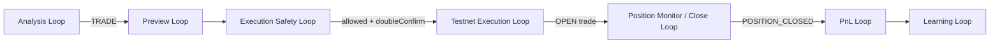

# V2 Loop Contracts

Branch: **`v2-core`**

Every MVP in v2 must be delivered as a **verifiable loop** — not as disconnected UI panels or orphan API routes. A loop contract defines what triggers the loop, what it does, what it produces, when it must stop, and what evidence proves it ran.

Related docs:

- [V2_ARCHITECTURE.md](./V2_ARCHITECTURE.md) — module boundaries and core flow
- [V2_EVENT_MODEL.md](./V2_EVENT_MODEL.md) — journal schema and event types
- [V2_SAFETY_RULES.md](./V2_SAFETY_RULES.md) — non-negotiable safety rules
- [V2_MVP_EXIT_CRITERIA.md](./V2_MVP_EXIT_CRITERIA.md) — MVP exit checklists (e.g. MVP 5)
- `.cursor/rules/v2-loop-engineering.md` — agent guardrails for loop discipline

---

## Loop contract template

Each loop below follows this shape:

| Section | Purpose |
|---------|---------|
| **Input** | What starts the loop (user action or prior loop output) |
| **Process** | Ordered steps; journal writes; server-side only for secrets |
| **Output** | Durable artifacts (events, derived views, API responses) |
| **Stop conditions** | Hard stops — loop must not proceed |
| **Evidence** | Observable proof in UI, APIs, tests, or journal |

**Rules (all loops):**

- Event Journal is the source of truth; UI reads APIs that derive from journal.
- Live trading remains locked (`BINANCE_LIVE_ENABLED=false`).
- Testnet only; no auto-execute; no force close.
- Every loop append-only events; never mutate history.
- Every loop has automated tests for stop conditions and happy path evidence.

---

## 1. Analysis Loop

**Status:** Implemented (MVP 1–2)

### Input

- User clicks **Start AI** (Dashboard) or `POST /api/analysis/run`

### Process

1. Create `runId`
2. Create `decisionLogId`
3. Append `ANALYSIS_STARTED` (environment = testnet)
4. Evaluate config, mock signal, and engine rules
5. Generate verdict (`WAIT` | `TRADE` | `BLOCKED`) with confidence and reasons
6. Append `VERDICT_CREATED`
7. Append `MISSION_SNAPSHOT_UPDATED` (derived mission fields)

### Output

- `AnalysisResult` (`runId`, `decisionLogId`, verdict payload)
- Updated mission snapshot projection (equity, progress, latest verdict)

### Stop conditions

- Testnet not configured (`BINANCE_TESTNET_ENABLED` not true) → verdict `BLOCKED`
- Binance credentials missing when a `TRADE` signal would run → verdict `BLOCKED` (safe default)
- Engine / journal write error → no partial silent success; append `ERROR_RECORDED` if applicable

### Evidence

| Evidence | Where |
|----------|--------|
| `runId` visible | Dashboard, AI Status, `/api/analysis/latest` |
| `decisionLogId` visible | Dashboard, AI Status, journal events |
| `ANALYSIS_STARTED` | `/api/journal/events`, AI Status |
| `VERDICT_CREATED` | `/api/journal/events`, AI Status |
| `MISSION_SNAPSHOT_UPDATED` | `/api/journal/events`, `/api/mission/snapshot` |

**Tests:** `src/lib/sprint1.test.ts`, `src/lib/mvp2-preview.test.ts`, `src/lib/mvp46-zero-state.test.ts`

---

## 2. Preview Loop

**Status:** Implemented (MVP 2)

### Input

- `TRADE` verdict from Analysis Loop (same `runId` + `decisionLogId`)

### Process

1. Create `previewId`
2. Validate preview constraints (symbol, notional, environment = TESTNET, `decisionLogId`, `runId`)
3. If blocked → append `PREVIEW_BLOCKED`
4. If allowed → append `PREVIEW_CREATED` with `expiresAt`, qty estimate, side, symbol

### Output

- Active testnet preview (status `ACTIVE` until expired/cancelled)
- Preview visible via `/api/execution/preview/latest` and mission snapshot

### Stop conditions

- Missing `decisionLogId` → `PREVIEW_BLOCKED`
- Missing `runId` → `PREVIEW_BLOCKED`
- Invalid symbol (not in allowlist) → `PREVIEW_BLOCKED`
- Invalid notional (over max) → `PREVIEW_BLOCKED`
- Live environment requested → blocked
- Verdict not `TRADE` → no preview created

### Evidence

| Evidence | Where |
|----------|--------|
| Latest preview | Dashboard “Latest preview” panel |
| `PREVIEW_CREATED` or `PREVIEW_BLOCKED` | AI Status, `/api/journal/events` |
| Preview summary | Reports → Execution Safety Gate section |
| `previewId` linked to `decisionLogId` | Journal envelope fields |

**Tests:** `src/lib/mvp2-preview.test.ts`

---

## 3. Execution Safety Loop

**Status:** Implemented (MVP 3)

### Input

- `previewId` + `doubleConfirm` (Review modal or `POST /api/execution/review`)

### Process

1. Load preview from journal
2. Review blockers: live lock, kill switch, testnet connection, expiry, duplicate order, missing IDs
3. Record `doubleConfirm` provided or missing
4. Append `EXECUTION_REVIEWED` with allowed/blocked result
5. If blocked → append `EXECUTE_BLOCKED` (and typed block events: `PREVIEW_EXPIRED`, `DUPLICATE_ORDER_BLOCKED`, `KILL_SWITCH_BLOCKED`, `DOUBLE_CONFIRM_REQUIRED` as applicable)

### Output

- `ExecutionSafetyResult` (`allowed`, `blockers`, `warnings`, `reviewedAt`)
- Reports gate status: `NO_PREVIEW` | `READY_FOR_REVIEW` | `BLOCKED` | `READY_FOR_EXECUTION_NEXT_MVP`

### Stop conditions

- Any **hard blocker** → `allowed = false`; execute must not proceed
- Missing `previewId` → blocked
- Missing `decisionLogId` on preview → blocked
- Preview expired → blocked
- Duplicate order detected → blocked
- Kill switch active → blocked
- Testnet disconnected (or mock disconnected) → blocked
- `doubleConfirm !== true` → blocked (`DOUBLE_CONFIRM_REQUIRED`)
- Live trading enabled → blocked

### Evidence

| Evidence | Where |
|----------|--------|
| `EXECUTION_REVIEWED` | AI Status, journal |
| `EXECUTE_BLOCKED` or gate passed | AI Status, Reports gate |
| `READY_FOR_EXECUTION_NEXT_MVP` | Reports when review allowed + double confirm |
| Blocker codes | Dashboard review modal, `/api/execution/review/latest` |

**Tests:** `src/lib/mvp3-execution-safety.test.ts`, `src/lib/reports/reports-gate.test.ts`

---

## 4. Testnet Execution Loop

**Status:** Implemented (MVP 4)

### Input

- Approved preview from Execution Safety Loop (`allowed = true`, `doubleConfirm = true`)
- `POST /api/execution/testnet/execute` with `{ previewId, doubleConfirm: true }`

### Process

1. Re-run safety gate (fail closed)
2. Verify Binance testnet status = `CONNECTED` (server-side only; API secret never exposed)
3. Send Binance testnet **MARKET** order (not reduce-only open)
4. Append `ORDER_EXECUTED` with order summary
5. On accepted fill → append `POSITION_OPENED`
6. Append `MISSION_SNAPSHOT_UPDATED`
7. Derive **OPEN trade** from journal (`ORDER_EXECUTED` + `POSITION_OPENED`, not yet `POSITION_CLOSED`)

### Output

- OPEN trade (`tradeId`, `previewId`, `decisionLogId`, symbol, side, qty, entry)
- Execute result API response (`orderId`, `tradeId`, blockers if any)

### Stop conditions

- Binance disconnected / `MISSING_ENV` / region block → no order; `EXECUTE_BLOCKED`
- Any safety gate blocker → no order
- `doubleConfirm !== true` → blocked
- Live environment → blocked
- Kill switch active → blocked
- Preview expired or not found → blocked
- Exchange error → `ERROR_RECORDED`, `EXECUTE_BLOCKED`; no fake success

### Evidence

| Evidence | Where |
|----------|--------|
| `ORDER_EXECUTED` | AI Status, journal |
| `POSITION_OPENED` | AI Status, journal |
| OPEN trade row | `/api/trades`, Trades page |
| Execution count | Dashboard, Reports |

**Tests:** `src/lib/mvp4-execute.test.ts`

**Explicit non-goals:** No live orders. No auto-execute. No force execute.

---

## 5. Position Monitor / Close Loop

**Status:** Implemented (MVP 5)

### Input

- OPEN trade exists (from Testnet Execution Loop)

### Process

**Monitor path**

1. `POST /api/positions/refresh` (or Dashboard “Refresh position”)
2. Fetch Binance testnet positions (server-side)
3. Match to OPEN trade by symbol, side, qty, `decisionLogId` / `previewId` when available
4. Append `POSITION_MONITORED` with `PositionSnapshot` payload
5. Run reconciliation; append `POSITION_RECONCILIATION_WARNING` if mismatches
6. Append `MISSION_SNAPSHOT_UPDATED` (phase = position refresh)

**Close path**

1. `POST /api/execution/testnet/close-preview` with `{ tradeId }`
2. Validate OPEN trade, active position, testnet connected, live locked
3. Append `CLOSE_PREVIEW_CREATED` or `CLOSE_PREVIEW_BLOCKED` (`reduceOnly = true` always)
4. User double-confirms → `POST /api/execution/testnet/close` with `{ closePreviewId, doubleConfirm: true }`
5. Run close safety gate → append `CLOSE_REVIEWED` / `CLOSE_BLOCKED`
6. Send Binance testnet **MARKET reduce-only** close order
7. Append `CLOSE_ORDER_EXECUTED`
8. Refresh position; if flat → append `POSITION_CLOSED` (realized PnL deferred to PnL loop)

### Output

- `PositionSnapshot` (mark, unrealized PnL, status `OPEN` | `FLAT` | `UNKNOWN`)
- Reconciliation status (`OK` | `WARNING` | `BLOCKED`)
- Close preview (`reduceOnly: true`, `sideToClose` opposite of position side)
- Closed trade projection when `POSITION_CLOSED` appended

### Stop conditions

- No OPEN trade → zero-state; no close preview
- Position state `UNKNOWN` → block close preview and close execute
- Binance not `CONNECTED` → block refresh evidence / block close
- Reconciliation `BLOCKED` → block close
- Close preview expired → block close
- `doubleConfirm !== true` → block close
- `reduceOnly !== true` → block close (hard invariant)
- Kill switch / live locked violations → block
- No force close; no reverse position; no auto-close

### Evidence

| Evidence | Where |
|----------|--------|
| `POSITION_MONITORED` | AI Status, journal |
| Dashboard position panel | `/api/mission/snapshot`, `/` |
| Trades position snapshot | `/api/trades`, Trades page |
| `CLOSE_PREVIEW_CREATED` | AI Status, journal |
| `CLOSE_ORDER_EXECUTED` | AI Status, journal |
| `POSITION_CLOSED` | Trades closed section, journal |

**Tests:** `src/lib/mvp5-position-close.test.ts`

---

## 6. PnL Loop

**Status:** Planned (MVP 6)

### Input

- `POSITION_CLOSED` event exists for a `tradeId`
- Exchange fill data or journal order payloads with entry/exit prices

### Process

1. Load open trade lifecycle from journal (`ORDER_EXECUTED`, `POSITION_OPENED`, close order events)
2. Resolve entry and exit prices (prefer exchange data; fail closed if missing)
3. Calculate net realized PnL (fees optional per MVP 6 spec)
4. Classify result (`WIN` | `LOSS` | `BREAKEVEN` | `UNKNOWN`)
5. Append `PNL_REALIZED` linked to `tradeId`, `decisionLogId`, `runId`
6. Append `MISSION_SNAPSHOT_UPDATED` (equity, net PnL, win/loss counts)

### Output

- Realized PnL on closed trade projection
- Updated mission equity and progress toward $10,000 target
- Reports realized PnL section (non-zero when evidence exists)

### Stop conditions

- Missing entry price → do not emit `PNL_REALIZED`; record `ERROR_RECORDED` or pending state
- Missing exit price / fill → stop; remain “Pending PnL” in UI
- Trade not in `POSITION_CLOSED` state → do not realize
- Duplicate `PNL_REALIZED` for same `tradeId` → blocked

### Evidence

| Evidence | Where |
|----------|--------|
| `PNL_REALIZED` | Journal |
| Reports PnL | `/api/reports/summary`, Reports page |
| Mission equity update | `/api/mission/snapshot`, Dashboard |
| Win/loss counts | Mission snapshot, Reports |

**Tests:** To be added in MVP 6 (`mvp6-pnl.test.ts` or equivalent)

---

## 7. Learning Loop

**Status:** Planned (post-MVP 6)

### Input

- Closed trade with realized PnL (`PNL_REALIZED` exists)
- Valid `tradeId` and `decisionLogId`

### Process

1. Build learning record from trade lifecycle + verdict reasons + PnL result
2. Generate `learningId`
3. Append `LEARNING_CREATED` with links to `tradeId`, `decisionLogId`, `runId`
4. Update reports learning count projection

### Output

- Learning record in journal
- Incremented learning count in Reports

### Stop conditions

- Missing `tradeId` → do not create learning
- Missing `decisionLogId` → do not create learning
- No `PNL_REALIZED` for trade → defer learning until PnL loop completes
- Duplicate learning for same `tradeId` → blocked

### Evidence

| Evidence | Where |
|----------|--------|
| `LEARNING_CREATED` | Journal |
| Learning count | `/api/reports/summary`, Reports page |
| Linked IDs | Event envelope (`tradeId`, `decisionLogId`) |

**Tests:** To be added with Learning MVP

---

## Loop dependency graph

No loop may skip its upstream contract. MVP work must close the loop (input → process → output → evidence → tests) before the next loop is considered done.

---

## MVP ↔ loop mapping

| MVP | Primary loop(s) | Exit doc |
|-----|-----------------|----------|
| MVP 1–2 | Analysis, Preview | Roadmap + tests |
| MVP 3 | Execution Safety | `mvp3-execution-safety.test.ts` |
| MVP 4 | Testnet Execution | `mvp4-execute.test.ts` |
| MVP 4.6 | Zero-state / config gate (cross-cutting) | `mvp46-zero-state.test.ts` |
| MVP 5 | Position Monitor / Close | [V2_MVP_EXIT_CRITERIA.md](./V2_MVP_EXIT_CRITERIA.md) |
| MVP 6 | PnL | TBD |
| MVP 7+ | Learning | TBD |

---

## Verification checklist (per loop change)

Before merging any loop-related change:

- [ ] Loop contract section updated if behavior changed
- [ ] Journal events appended (no silent state)
- [ ] Stop conditions tested
- [ ] Evidence visible via API (UI reads API only)
- [ ] No live trading paths enabled
- [ ] No auto-execute / auto-close introduced
- [ ] `npm test` and `npm run build` pass

---

## Core engine loop contracts

Typed loop IDs mirror this document in code: `src/lib/core/loop-contracts.ts`.

Lifecycle FSM: `src/lib/core/lifecycle-state-machine.ts`  
Trace/replay: `GET /api/core/trace/[id]`, `POST /api/core/replay`

See [CORE_ENGINE_UPGRADE_DESIGN.md](./CORE_ENGINE_UPGRADE_DESIGN.md).
